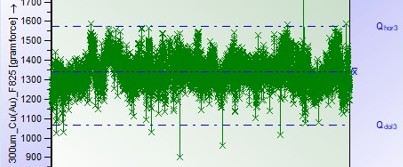

  

# 📈 Statistical Process Control (SPC) of Shear-Force

Tento projekt monitoruje kvalitu wire bondingu pomocou štatistických metód.

👉 **[Zobraziť stránku s grafmi a dizajnom tu](https://cernju.github.io/SPC---Shear-Force/)**

## Popis procesu:
- Zber dát z produkcie...
- Transformácia do Q-DAS...
- Regulačný diagram
